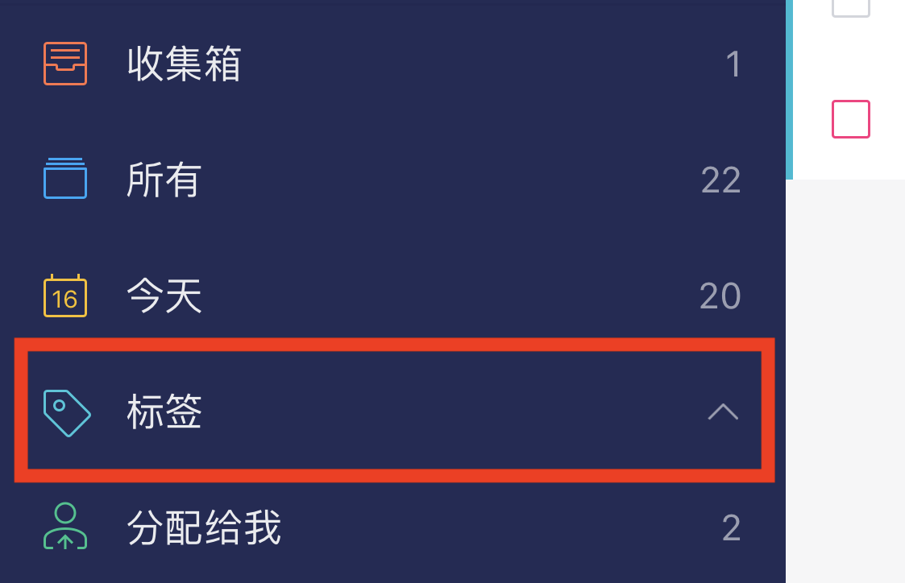
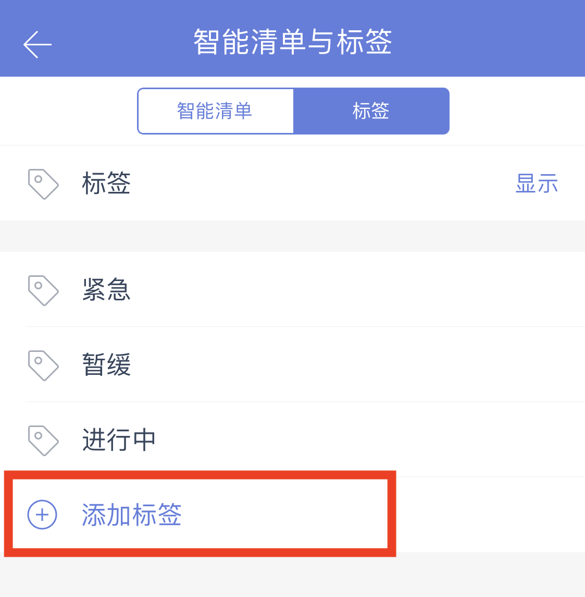
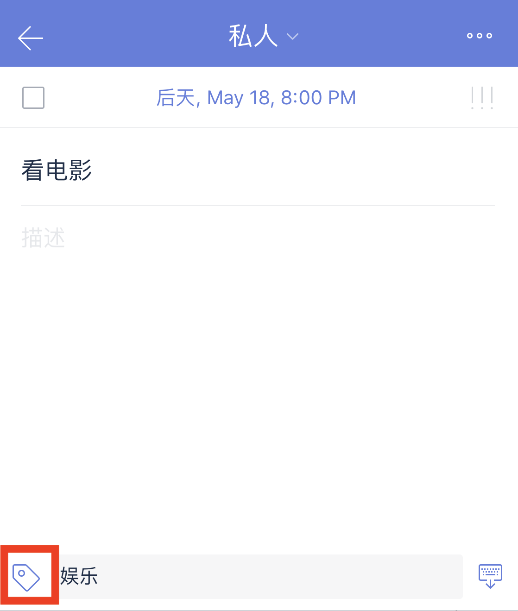
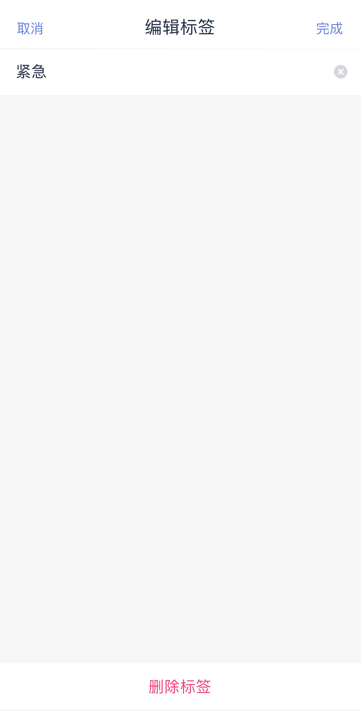
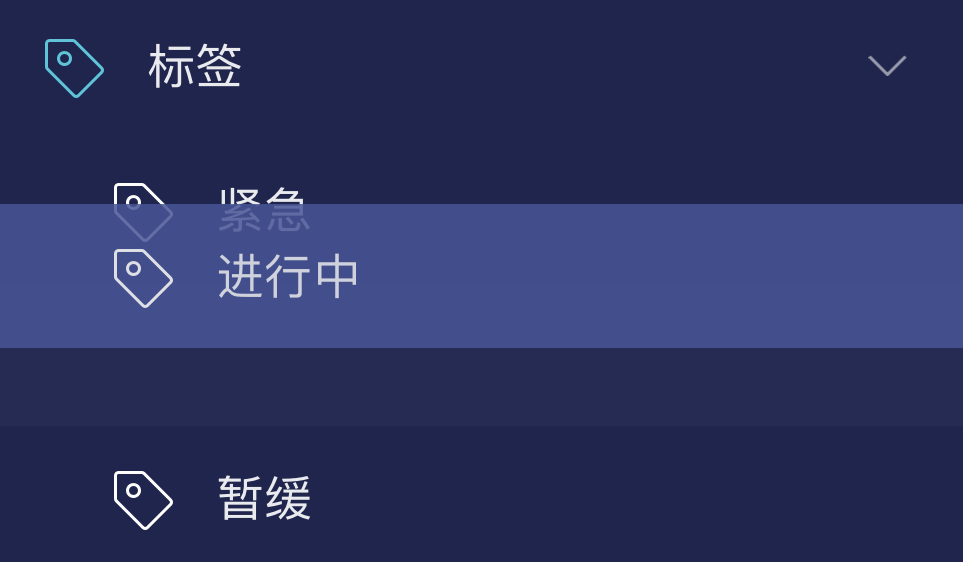
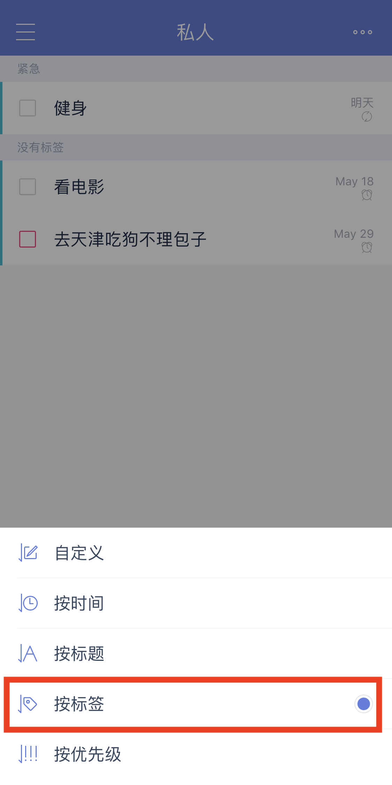

####在左侧边栏中显示标签
给任务添加标签可以帮助更加快捷的进行任务管理。

一个任务可以添加一个或者多个标签，标签常常和类别、状态或者地点关联。

使用前，首先可以确认左侧边栏中是否已经开启显示标签。开启后，标签会和其他的智能清单如：【收集箱】、【今天】等显示在一起。

如果左侧边栏没有看到标签，可以在【设置】-【智能清单与标签】-【标签】- 选择为【显示】即可。

####预添加标签
如果你已经有了一套清晰的标签系统，即使没有任务也可以直接在滴答清单中添加独立的标签。

比如使用标签来区分任务状态，就可以提前添加好“进行中”、“暂缓”等一系列和状态相关的标签。

进入【智能清单与标签】-【标签】-【添加标签】，即可开始创建标签系统了。

####为任务添加标签
如果需要为一条任务添加特定标签时，可以在进入任务详情后，点击键盘上方操作栏左侧的【标签】图标输入标签，滴答清单会直接在键盘上方展开输入框，输入标签后点击“空格”或“回车”完成添加。添加成功的标签会展示在文本内容下方。

除了在键盘上方操作外，也可以在详情页的菜单栏里找到添加标签的入口。点击【...】图标并选择【标签】，即可一次性添加多个标签。

使用快速添加创建任务时，也可以通过点击快速添加条上的【标签】图标然后输入文字，添加成功进入任务详情后，标签同样会展现在文本内容下方。

####标签的编辑与删除
当需要为标签编辑名字或删除时，可以在左侧边栏通过左滑该标签名，然后选择【编辑】或【删除】。

设置页面内，找到【智能清单与标签】-【标签】，也可以对标签进行编辑或删除。

成功操作后，所有包含这个标签的任务都会对应更新。如果选择删除某标签，该标签会从之前所分配的任务中移除，任务并不会被删除。

####标签排序
一千个使用标签的用户，可能就有一千种为标签排序的方法，不管是将常用标签排在前面，还是按照特定的规则进行排序，你都能在侧边栏长按标签拖拽来实现。

同时，你也可以在任务列表中选择【按标签排序】，为任务进行以标签为维度的排序，帮助更加快速智能的了解自己的日程安排。

注：除了通过排序来查看各标签下的任务外，在任务列表的【详细模式】下查看任务时，标签信息会展现成独立的一行，你可以很快了解到哪些任务有标签、这些任务分别有什么标签，无需进入任务详情查看。